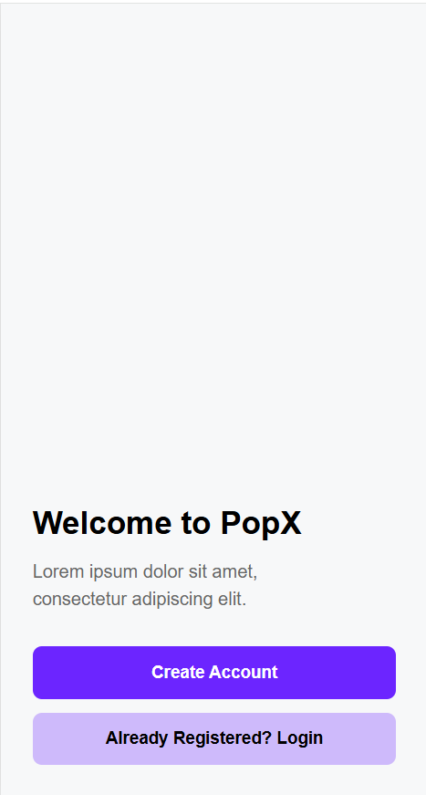
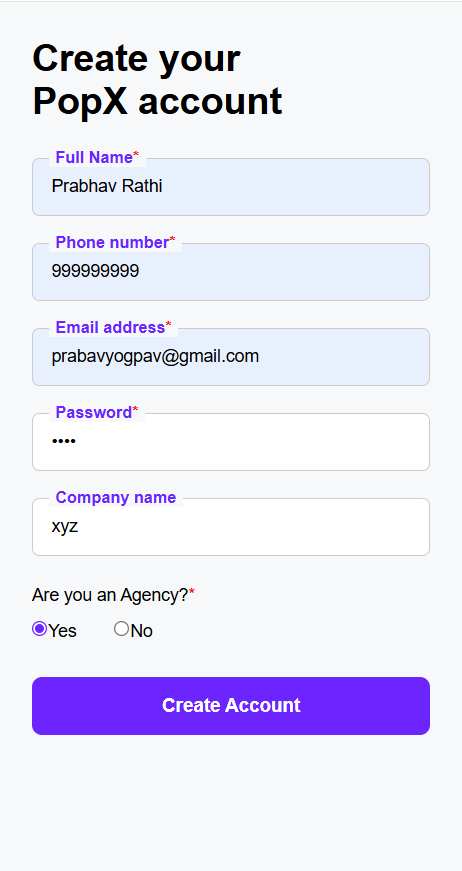
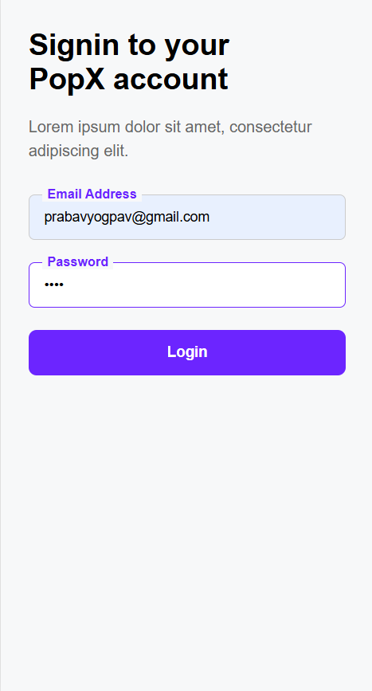
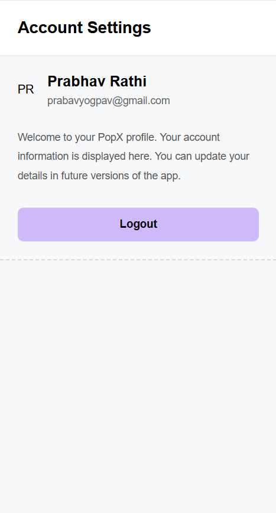

# PopX App

> A responsive, mobile-first React application implementing the **PopX** UI assignment—a clean and minimal user authentication flow with landing, signup, login, and profile screens. Developed as part of the EduCase UI/UX Developer assignment.

## Live Links

- **Working Demo (Vercel)**: `https://popx-educase-psi.vercel.app/`
- **GitHub Repository**: `https://github.com/PrabhavRathi06/popx_educase`

---

## 📸 Project Showcase & Screenshots

### 1. Landing Page
Clean welcome screen with a bold "Welcome to PopX" heading and two clear call-to-action buttons—Create Account and Already Registered Login.


### 2. Create Account (Sign Up) Page
A full registration form collecting Full Name, Phone Number, Email Address, Password, Company Name, and Agency status—with required field indicators and instant validation.


### 3. Login Page
Minimal sign-in screen with Email Address and Password fields. The Login button activates dynamically only when both fields are filled, with error feedback for invalid credentials.


### 4. Account Settings (Profile Page)
Post-login profile page displaying user initials avatar, full name, email, and a welcome description. Includes a Logout button that clears the session and redirects to the landing screen.


---

## Features

- **Landing Screen:** Bold welcome layout with two distinct action buttons for new and returning users, built on a minimal light-grey background for a clean first impression.
- **User Registration:** Full sign-up form with five input fields and an agency radio selector. Validates required fields before saving user data to Local Storage and redirecting to login.
- **Local Storage Authentication:** Stores user credentials in the browser's Local Storage—no backend required. Login validates email and password against the saved record and shows inline error messages on mismatch.
- **Dynamic Profile Page:** Reads user data directly from Local Storage to display a personalized initials-based avatar, full name, and email address on the Account Settings screen.
- **Session Logout:** A single Logout button clears the stored user session and navigates back to the landing page, simulating a complete auth cycle.
- **Responsive Mobile-First UI:** All pages are designed for narrow mobile viewports with full-width inputs, large tap-friendly buttons, and clean vertical layouts.

---

## Technology Stack

| Layer | Technology |
|-------|-----------|
| **Core Framework** | React JS 19 |
| **Routing Engine** | React Router DOM (v7) |
| **Styling** | Vanilla CSS3 with Mobile-First Layouts |
| **Session Storage** | Browser LocalStorage API |
| **Build Tooling** | Vite |

---

## Project Structure

```text
popx_educase/
├── src/
│   ├── assets/              # Static assets and app screenshots
│   │   ├── landing_page.png # Landing page screenshot
│   │   ├── signup_page.png  # Sign up page screenshot
│   │   ├── login_page.png   # Login page screenshot
│   │   ├── profile_page.png # Profile page screenshot
│   │   └── popx_logo.png    # App logo
│   ├── components/          # Reusable UI components
│   │   ├── Button.jsx       # Primary & secondary button variants
│   │   └── Input.jsx        # Labeled input field with floating label
│   ├── pages/               # Route-level page components
│   │   ├── Landing.jsx      # Welcome / home screen
│   │   ├── Signup.jsx       # User registration form
│   │   ├── Login.jsx        # Sign-in screen with validation
│   │   └── Profile.jsx      # Authenticated account settings page
│   ├── styles/              # Component and page-level stylesheets
│   ├── App.jsx              # Route definitions and BrowserRouter setup
│   └── main.jsx             # Application entry point
```

---

## Local Setup Instructions

### Prerequisites
- Node.js 18+
- npm or yarn

### 1. Installation
```bash
# Clone the repository
git clone https://github.com/PrabhavRathi06/popx_educase.git
cd popx_educase

# Install required dependencies
npm install
```

### 2. Launch Development Server
```bash
# Run local dev server
npm run dev
```
> **Local App URL:** `http://localhost:5173/`

### 3. Build for Production
```bash
# Compile and build bundle
npm run build
```

---
*Built for EduCase UI/UX Freshers Evaluation.*
